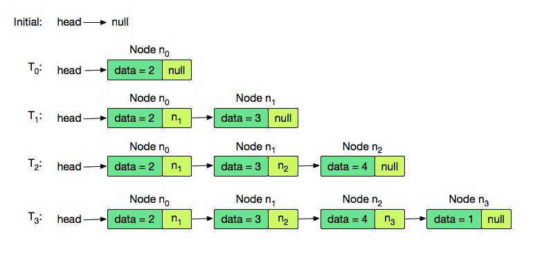

# Day 15: Linked List

## Objective
A Node class is provided for you in the editor. A Node object has an integer data field,`data`, and a Node instance pointer,`next`, pointing to another node (i.e.: the next node in the list).

A Node insert function is also declared in your editor. It has two parameters: a pointer,`head`, pointing to the first node of a linked list, and an integer,`data`, that must be added to the end of the list as a new Node object.

### Task 
Complete the insert function in your editor so that it creates a new Node (pass `data` as the Node constructor argument)and inserts it at the tail of the linked list referenced by the `head`parameter. Once the new node is added, return the reference to the `head` node.

**Note:** The `head` argument is null for an empty list.

### Input Format

The first line contains T, the number of elements to insert. 

Each of the next `T` lines contains an integer to insert at the end of the list.

### Output Format

Return a reference to the`head` node of the linked list.
```markdown
Sample Input

STDIN   Function
-----   --------
4       T = 4
2       first data = 2
3
4
1       fourth data = 1 

Sample Output
2 3 4 1 
```
### Explanation
- `T = 4`, so your method will insert `4`nodes into an initially empty list. 
-- First the code returns a new node that contains the
data value `2`as the`head` of the list. Then create and insert nodes `3`,`4`, and `1` at the tail of the list.

