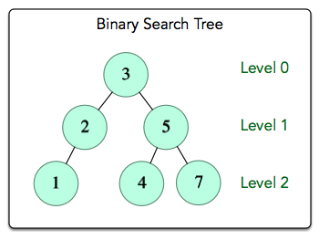

# Day 23: BST Level-Order Traversal

## Task

A level-order traversal, also known as a breadth-first search, visits each level of a tree's nodes from left to right, top to bottom. You are given a pointer, `root`, pointing to the root of a binary search tree. Complete the levelOrder function provided in your editor so that it prints the level-order traversal of the binary search tree.

**Hint:** You'll find a queue helpful in completing this challenge. 

#### Function Description

Complete the levelOrder function in the editor below.

*levelOrder* has the following parameter:

- Node pointer root: a reference to the root of the tree

#### Prints

- Print node.data items as space-separated line of integers. No return value is expected.
### Input Format

The locked stub code in your editor reads the following inputs and assembles them into a BST: <br>
The first line contains an integer,`T` (the number of test cases).<br>
The `T` subsequent lines each contains an integer,`data`, denoting the value of an element that must be added to the BST.

**Constraints**

- `1 ≤ N ≤ 20`
- `1 ≤ node.data[i] ≤ 100`
### Output Format

Print the `data`value of each node in the tree's level-order traversal as a single line of `N`space-separated integers.
```markdown
Sample Input 
6 

3 
5
4 
7 
2 
1

Sample Output 
3 2 5 1 4 7 
```
### Explanation
The input forms the following BST:

We traverse each level of the tree from the root downward, and we process the nodes at each level from left to right.
The resulting level-order traversal is `3 -> 2 -> 5 -> 1 -> 4 -> 7`, and we print these data values as a single line of space-separated integers.
